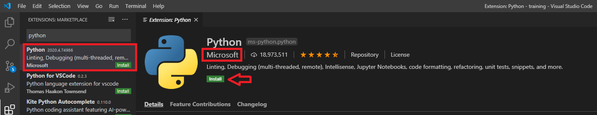

# Git and VSCode

This repository is designed to be used for you to practice getting your
development environment setup to work with a team on a simple Flask project.

# What You Need

- A Windows or macOS computer.
  - Linux based OSes will work too, but you are on your own!
- VSCode (see prerequisites below)
- Git SCM (see prerequisites below)
- A GitHub account

# Prerequisites

- Install VSCode for your operating system: https://code.visualstudio.com/
  - You may leave all installer options at the default selections.
- Install Git for your operating: https://git-scm.com/
  - Click the Next button leaving all the installer options as the default, until you reach "Which editor would you like Git to use?" and select "Use Visual Studio Code as Git's default editor"
  - All other options may be left as default.
- Python 3 - see the Python Installation section below for your operating system.

# Step 1: Python Installation

## Windows

- Visit https://www.python.org/ then hover over the **Downloads** link, and click the "Python 3.X.Y" (version number may vary)

  
- :warning: Before clicking **Install Now**, tick the box next to "Add Python 3.X to PATH" :warning:

  

- Click **Install Now** and let the installer complete.

## macOS

TODO

# Step 2: Git Setup

Before starting, create a projects folder somewhere on your computer where you will remember. All of your git projects should be stored in this folder.

A good could be a Projects folder created inside your Documents folder.

- Open VSCode for the first time.
- Launch the Command Palette (Windows: `Ctrl+Shift+P`, macOS: `⌘⇧P`) and type in `clone`
- **Git: Clone** will appear - press `Enter`
- Paste in the URL for this repository: `https://github.com/codewizardshq/apps.git` and press `Enter`
- A folder window will appear. Navigate to the projects folder you created and click the **Select Repository Location** button.
- You may be asked to enter your GitHub credentials. Enter the username and password to your GitHub account if prompted.
- VSCode will offer to open the project for you - go ahead and click Open Project.

# VSCode Setup

Before beginning development, we want to perform some basic setup in Visual Studio Code.

## Python Extension

- Go to Extensions in VSCode (Windows: `Ctrl+Shift+X`, macOS: `⌘⇧X`)
- Search for Python and install the Python extension by Microsoft

## Python Module Setup

All Flask projects require some 3rd party modules - the Flask library is written in Python but it does not come with the default Python installer. We need to install Flask ourselves, but luckily this is very easy with `pip` which can install 3rd party modules like Flask with minimal effort.

- Open a new terminal within VS Code using Ctrl+` (this is the backtick key, it is found below the Esc key)
- Type in `pip install -U pip` and press `Enter` to ensure pip is at the latest version
- Type in `pip install -U -r requirements.txt` to install all 3rd party requirements specific to this project

## Settings

TODO - all settings should be defined in a workspace `settings.json` file. The only difference will be settings that conflict on macOS and Windows installations, so those settings will need to be modified by the user in their own User `settings.json`. 

## Launching Flask

TODO - launching Flask can be defined in a `.vscode/launch.json` so students won't have to set env

# VSCode Useful Shortcuts

- Command Palette
  - Windows/Linux: `Ctrl+Shift+P`
  - macOS: `⌘⇧P`
