# Git and VSCode

This repository is designed to be used for you to practice getting your
development environment setup to work with a team on a simple Flask project.

# What You Need

- A Windows or macOS computer.
  - Linux based OSes will work too, but you are on your own!
- VSCode (see prerequisites below)
- Git SCM (see prerequisites below)
- A GitHub account

# Prerequisites

- Install VSCode for your operating system: https://code.visualstudio.com/
  - You may leave all installer options at the default selections.
- Install Git for your operating: https://git-scm.com/
  - Click the Next button leaving all the installer options as the default, until you reach "Which editor would you like Git to use?" and select "Use Visual Studio Code as Git's default editor"
  - All other options may be left as default.
- Python 3 - see the Python Installation section below for your operating system.

# Step 1: Python Installation

## Windows

- Visit https://www.python.org/ then hover over the **Downloads** link, and click the "Python 3.X.Y" (version number may vary)

  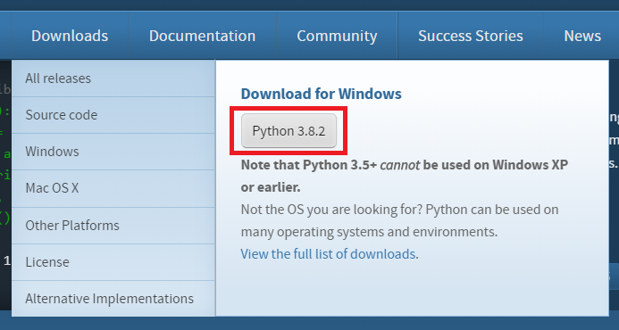
- :warning: Before clicking **Install Now**, tick the box next to "Add Python 3.X to PATH" :warning:

  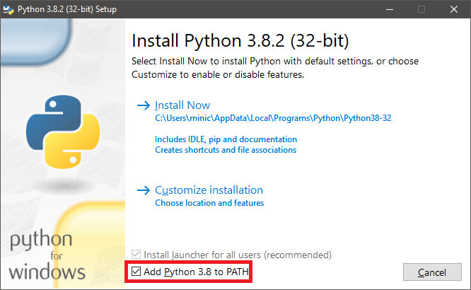

- Click **Install Now** and let the installer complete.

## macOS

TODO

# Step 2: Clone this repository with Git

Before starting, create a projects folder somewhere on your computer where you will remember. All of your git projects should be stored in this folder.

A good could be a Projects folder created inside your Documents folder.

- Open VSCode for the first time.
- Launch the Command Palette (Windows: `Ctrl+Shift+P`, macOS: `⌘⇧P`) and type in `clone`
- **Git: Clone** will appear - press `Enter`
- Paste in the URL for this repository: `git@github.com:cwhq-internship/cwhq-practice-repo.git` and press `Enter`
- A folder window will appear. Navigate to the projects folder you created and click the **Select Repository Location** button.
- You may be asked to enter your GitHub credentials. Enter the username and password to your GitHub account if prompted.
- VSCode will offer to open the project for you - go ahead and click Open Project.
- VSCode will notify you that this workspace has extension recommandations - click **Install All**
  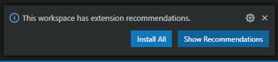

# Step 3: VSCode Setup

Before beginning development, we want to perform some basic setup in Visual Studio Code.

## Select Default Terminal (Windows only)

On Windows, the VSCode Terminal will be PowerShell which is not friendly for this type of work. To change it to the
standard cmd.exe:

- Use `Ctrl+Shift+P` to open the command pallette.
- Start typing in "select default shell" until `Terminal: Select Default Shell` is highlighted, then press `Enter`
- Click the `Command Prompt` option

# Step 4 Python Module Setup

## Windows Step Only: Modify your PATH variable

Go to Step 4a if you are not on Windows!

In order for Pipenv and Flask to work on the command line, we need to tell Windows where these new programs will be installed. To do so, you must edit your environment's PATH variables.

- Open the start menu and start typing "path" until you see "Edit the system environment variables" and hit Enter
  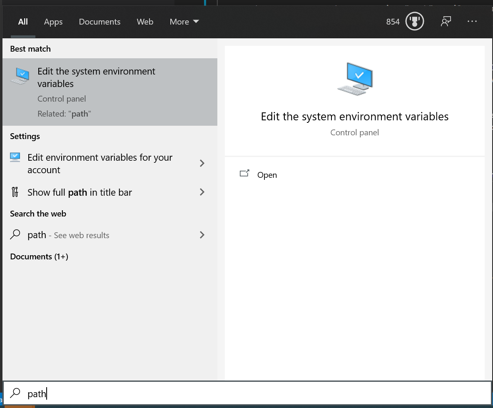
- Click "Environment Variables"

  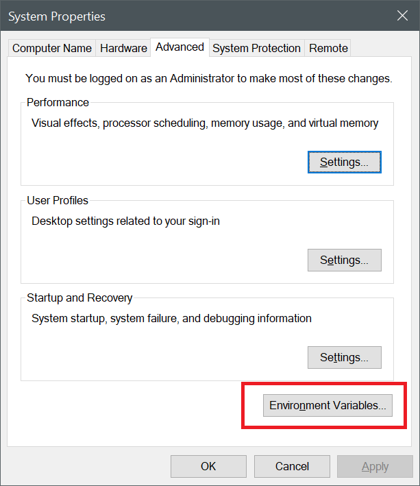
- In the upper box, click "Path" under "User variables for `username`
- Click Edit

  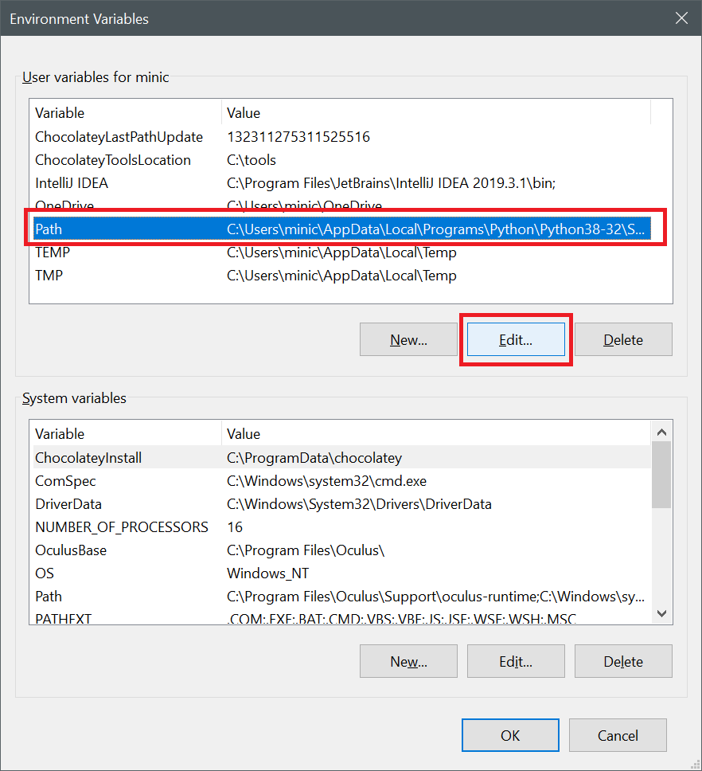
- Add 2 new entries, - :warning: Make sure you replace the username part with your Windows username!

  - `C:\Users\YOURUSERNAMEHERE\AppData\Local\Programs\Python\Python38-32\`
  - `C:\Users\YOURUSERNAMEHERE\AppData\Local\Programs\Python\Python38-32\Scripts\`
  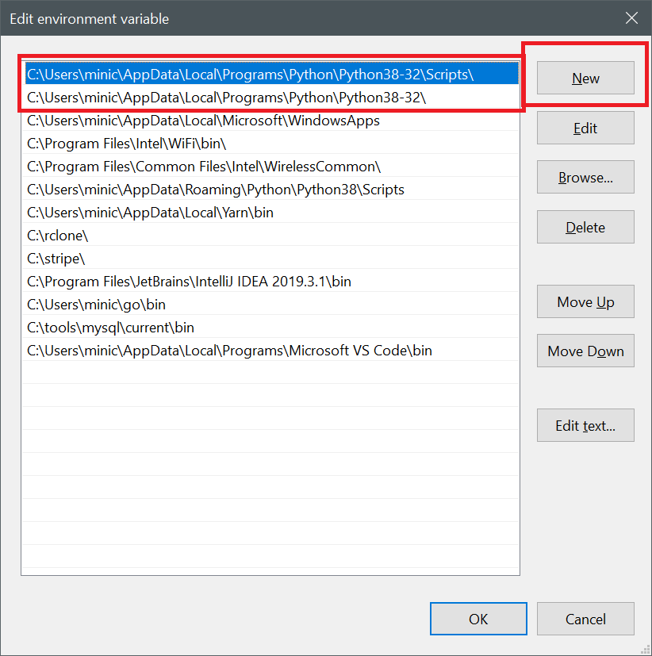

- Reboot your computer before continuing to the next step.

## Step 4a: Pipenv

All Flask projects require some 3rd party modules - the Flask library is written in Python but it does not come with the default Python installer. We need to install Flask ourselves, but luckily this is very easy with `pipenv` which can install 3rd party modules like Flask with minimal effort. It also manages the versions of these 3rd party modules we depend about.

- Open a new terminal within VS Code using Ctrl+` (this is the backtick key, it is found below the Esc key)
- Type in `pip install -U pip pipenv` and press `Enter` to ensure pip is at the latest version, and to install pipenv
  - :warning: If this step fails, you forgot to check the "Add Python 3.X to PATH" checkbox while installing Python. Go back to that step and re-install python.
- Type in `pipenv install --dev` to install all 3rd party requirements specific to this project
- Type in `pipenv shell` to enter into the Python environment
- Restart VSCode (required for Step 4b)

## Step 4b: Select Python Interpreter

Pipenv creates an isolated version of your installed Python. We need to tell VSCode to use this interpreter, otherwise
when we go to launch our Flask application, the 3rd party modules won't be found. You need to perform this step any time
you create a new pipenv environment (number 3 in step 4a)

- Use `Ctrl+Shift+P` to open the command pallete.
- Start typing in "interpreter" until `Python: Select Interpreter` appears and hit `Enter`
- You may be prompted to select the workspace, choose the first entry
  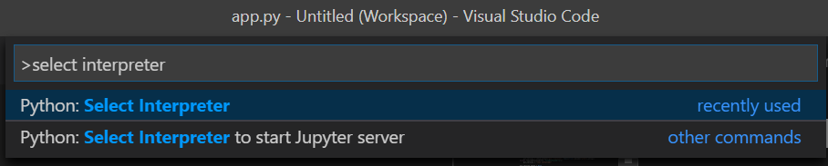

- Select the interpreter that has `pipenv` in the name and matches the name of the workspace you chose.
  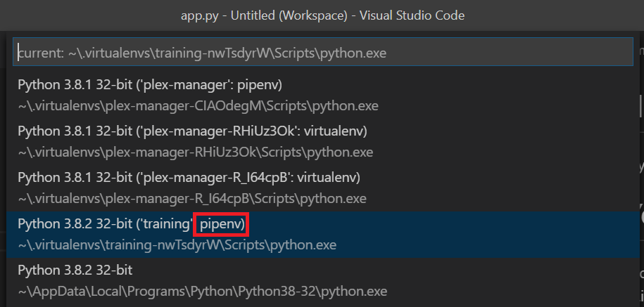

# Step 5: Launching Flask

Flask applications can be launched several different ways, but the most common way is on the command line using the `flask` command that comes with the flask pip package.

- Open a terminal in VSCode either via the Command Palette or with Ctrl Shift `
  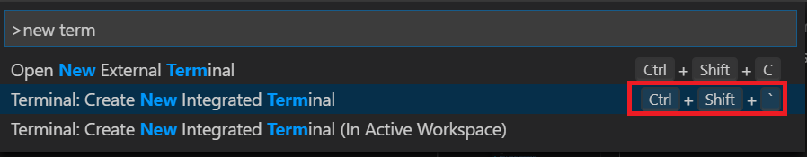
- Type in the following commands:
  - `set FLASK_APP=app.py`
  - `set FLASK_ENV=development`
  - `flask run`

  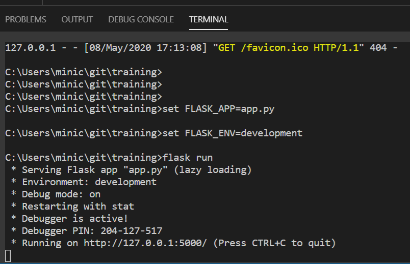

- Open a web browser tab  to the link shown in your terminal, most likely `http://127.0.0.1:5000`

If everything installed correctly, you should see a screen like this in your browser:

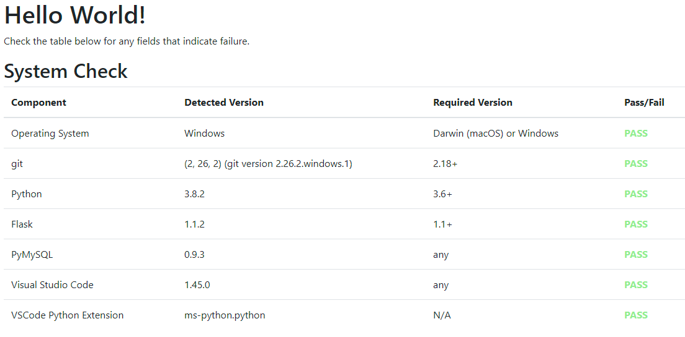

# Step 6: Try branching, committing, and opening a PR

To test your ability to use git and GitHub's workflow, you will make a new git branch from this very repository, add your name to an HTML file, and push that branch to GitHub. Then you will make a Pull Request to have it merged with master.

## Create a new branch

Creating a new branch allows you to work a feature for your project. The feature you will be writing in this repository is simply adding your name to the list of contributors in `docs/index.html`. You shouldn't just add your name to the file without creating a branch first.

- Open the VSCode Command Palette and type in "create branch" and select "Git: Create Branch ..."
  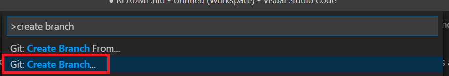

- Pick a name for your branch. Typically you'd use 1 or 2 words joined by hyphens instead of spaces that describes the feature.

  

VSCode will create the branch and checkout your new branch for you. In the bottom left corner of VSCode you will see "master" turn into your new branch name. Whichever branch is currently checked out is displayed there.

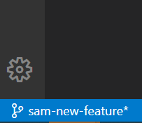

## Write code

This is something you already know. Go to `docs/index.html` and add your name below all of the existing names in the same HTML format as the others.

## Commit and push your changes

Once you've completed a small part of your feature, you **commit** your changes to git. When you commit, you describe in a sentence or two what your changes are.

- Click the VCS icon in the left side navigation bar of VSCode

  

- Under "Changes" you should see `index.html` which indicates git sees you have made revisions to this file. Click the plus sign next to it to "Stage" that change. This is so you can change multiple files at once, and commit them each separately if you wish.

- Enter in a message that describes what you did. Something like: "adding myself to the list of contributors"
- Click the Checkbox to commit your changes with your commit message.

  

- Click the three horizontal dots above the textbox where you entered your commit message, and click Push. This will push your changes to GitHub's remote repository so you can open a pull request, and so others can see your changes.

  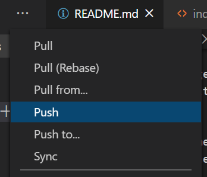

- Git will see this is a new branch and ask if you wish to publish it. Just click OK.

  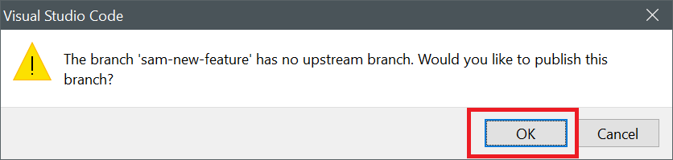

:warning: You must have "write" permission in GitHub in order to push to this repository, or you will get a Permission Denied message. Ask your Team Leader to add you if you cannot push.

## Make a Pull Request

Go to this repository's GitHub page [here](https://github.com/usrbinsam/cwhq-practice-repo) and click the Pull Requests tab.

- Make sure you are logged in to GitHub.
- GitHub see you just pushed a new branch and will offer to make a pull request for you. Click Compare & pull request
'
  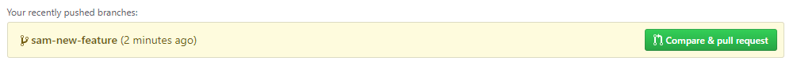

- This opens a new screen where you can type in a title and description for what your proposed changes are. You and other contributors will be able to make comments on your Pull Request.

  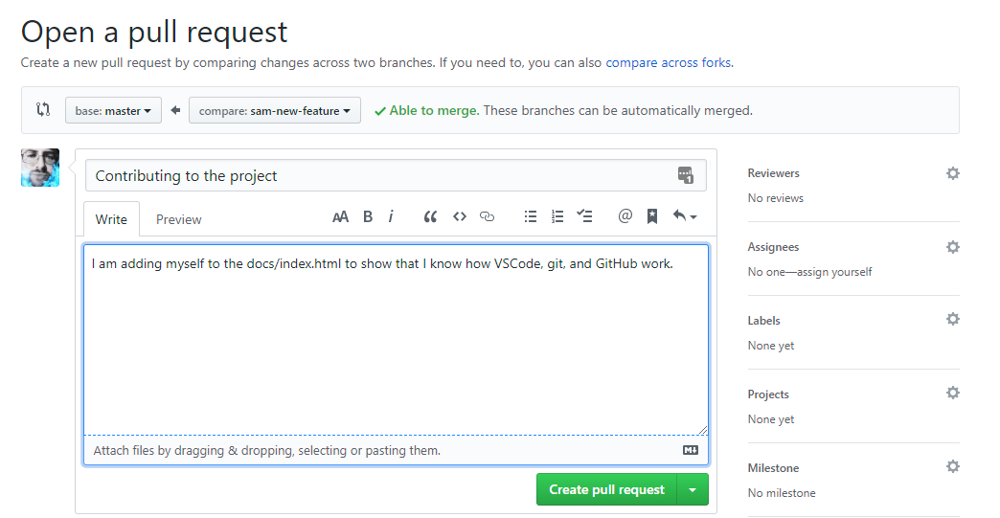

- Click Create Pull Request

Now you must wait for a Project Leader to approve your pull request. GitHub will email you once it has been merged, or if anyone makes comments on your Pull Request to make any changes. If you need to make changes, just repeat the Commit & Push steps above, and GitHub will automatically include those changes in this PR for you.

# VSCode Useful Shortcuts

- Command Palette
  - Windows/Linux: `Ctrl+Shift+P`
  - macOS: `⌘⇧P`
